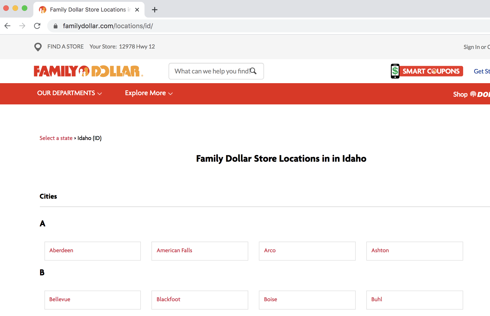
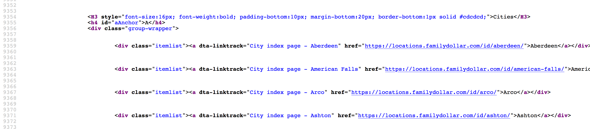
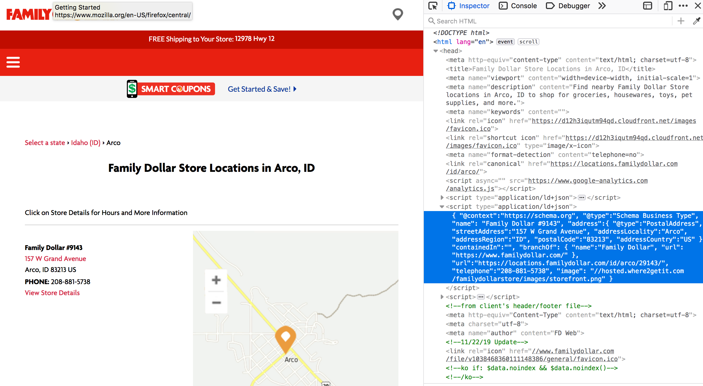
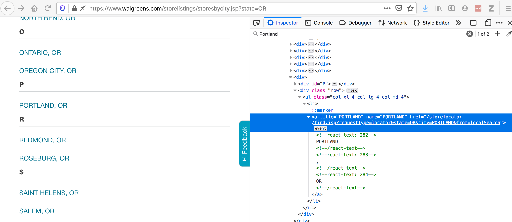
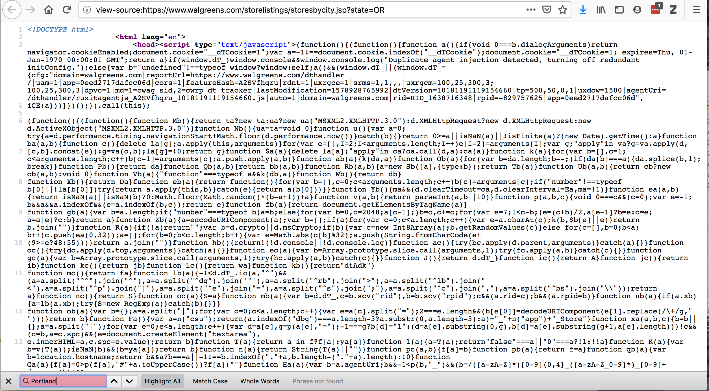
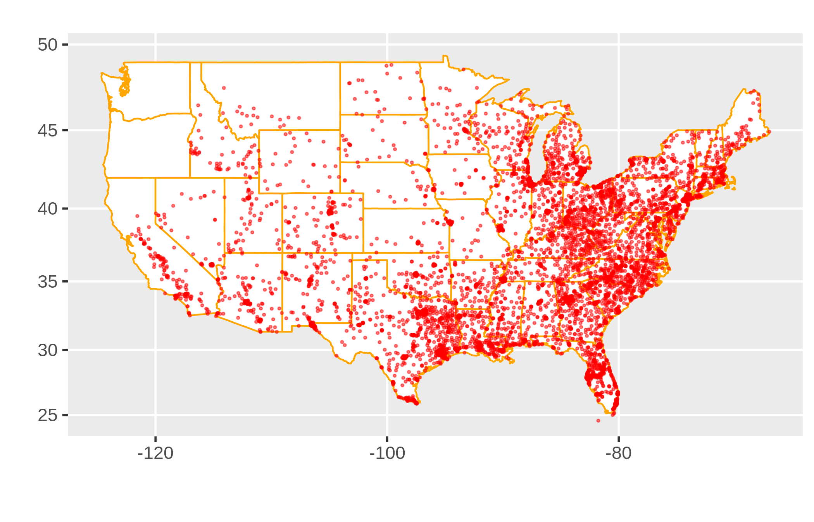

<style type="text/css">
body p {
  color: #282828;
}

ul {
  color: #282828;
}

code {
  color: ##0033cc;
}
</style>
                          
```{r setup, include=FALSE}
knitr::opts_chunk$set(echo = TRUE, error=TRUE, tidy=TRUE)
```


```{r wrap-hook, echo=FALSE}
library(knitr)
hook_output = knit_hooks$get('output')
knit_hooks$set(output = function(x, options) {
  # this hook is used only when the linewidth option is not NULL
  if (!is.null(n <- options$linewidth)) {
    x = knitr:::split_lines(x)
    # any lines wider than n should be wrapped
    if (any(nchar(x) > n)) x = strwrap(x, width = n)
    x = paste(x, collapse = '\n')
  }
  hook_output(x, options)
})
```

```{r echo=F}
library(reticulate)
virtualenv_create("pycas2020")
# a few things you might need to install
# py_install(c("requests", "json", "pandas", "DataFrame"))
# py_install(c("bs4", "Tag"))
use_virtualenv("pycas2020")
```

##

https://jpiaskowski.github.io/pycas2020_web_scraping/

## Good Way to Learn Python!

```{r, echo=FALSE, out.height='40%'}

```

## But, Who Actually Reads These A to Z?
(spoiler: not me)

```{r, echo=FALSE, fig.cap="me and my programming books", out.width='100%'}

```

##  The Main Things to Know in a Web Scraping Project: 
* Is it worth the troube?
* Is it ethical? 
* Using `BeautifulSoup` and `requests`
* what to look for in html code
* parsing json objects with <code>json</code>
* rudimentary `pandas` skills
* `<pro_tip> All you need to know about html is how tags work </protip>`

## What to Look for in a Scraping Project: {.columns-2}

```{r, echo=FALSE, out.width = '100%'}

```

* A sizeable amount of structured data with a regular repeatable format. 

* Identical formating is not required, but the more edge cases present, the more complicated the scraping will be. 

## Ethics in Scraping {.columns-2}

```{r, echo=FALSE, fig.cap = "Captain Marvel", out.width = '80%'}

```

Accessing vast troves of information can be intoxicating.   
   
*Just because it's possible doesn't mean it should be done*

## Legal Considerations 
*(note: I have zero legal training - this is not legal advice!)*

* Are you scraping copyrighted material? 
* Will your scraping activity compromise individual privacy?
* Are you making a large number of request that may overload or damage a server?
* Is it possible the scraping will expose intellectual property you do not own?
* Are there terms of service governing use of the website and are you following those? 
* Will your scraping activities diminish the value of the original data?


## Dollar Stores are Taking Over the World!

```{r, echo=FALSE, fig.cap="Store in Cascade, Idaho", out.width='60%'}
knitr::include_graphics("images/family_dollar_cascade_cropped.png")
```

**Goal:** Extract addresses for all Family Dollar stores in Idaho.

## The Starting Point: 

https://locations.familydollar.com/id/
```{r, echo=FALSE,out.width='80%'}

```

## Step 1: Load the Libraries

```{python}
import requests # for making standard html requests
from bs4 import BeautifulSoup # magical tool for parsing html data
import json # for parsing data
from pandas import DataFrame as df # data organization
```

## Step 2: Grab Some Data from Target Web Address

```{python}
page = requests.get("https://locations.familydollar.com/id/")
soup = BeautifulSoup(page.text, 'html.parser') 
```

Beautiful Soup will take html or xml content and transform it into a complex tree of objects. Here are several common types: 

* `BeautifulSoup` - the soup (the parsed content)  
* `Tag`  - main type of bs4 element you will encounter  
* `NavigableString` - string within a tag  
* `Comment` - special type of NavigableString


## Step 3: Determine How to Extract Relevant Content from bs4 Soup

This process can be frustrating. 
```{r, echo=FALSE, out.width='70%'}

```
 
## Step 3: Finding Content...

* Start with one representative example and then scale up
* Viewing the page's html source code is essential
  * Run at your own risk: 
```{python, eval=F, echo=T}
print(soup.prettify())
```
 
 
## Step 3: Finding Content...

 * It is usually easiest to browse via "View Page Source":
```{r, echo=FALSE, out.width='100%'}

```
* What attribute or tag sets your content apart from the rest? 

## Step 3: Finding Content by Searching

Searching for 'href' does not work.
```{python}
dollar_tree_list = soup.find_all('href')
dollar_tree_list
```

But searching on a specific class is often successful: 
```{python}
dollar_tree_list = soup.find_all(class_ = 'itemlist')
for i in dollar_tree_list[:2]:
  print(i)
```

## Step 3: Finding Target Content by Using 'contents'

```{python, collapse=TRUE}
type(dollar_tree_list)
len(dollar_tree_list)
```

Next, extract contents from this BeautifulSoup "ResultSet".

```{python}
example = dollar_tree_list[2] # Arco, ID (single representative example)
example_content = example.contents
print(example_content)
```

## Step 3: Finding Content in Attributes

Find out what attributes are present in the contents:

*Note: `contents` usually return a list of exactly one item, so the first step is to index that item.*
```{python}
example_content = example.contents[0]
example_content.attrs
```

Extract the relevant attribute: 
```{python}
example_href = example_content['href']
print(example_href)
```

## Step 4: Extract the Relevant Content

```{python}
city_hrefs = [] # initialise empty list

for i in dollar_tree_list:
    cont = i.contents[0]
    href = cont['href']
    city_hrefs.append(href)

#  check to be sure all went well
for i in city_hrefs[:2]:
  print(i)
```
Result: a list of URL's of Family Dollar stores in Idaho to scrape

## Repeat Steps 1-4 for the City URLs

```{python}
page2 = requests.get(city_hrefs[2]) # representative example
soup2 = BeautifulSoup(page2.text, 'html.parser')
```

```{r, echo=FALSE, out.width='100%'}

```

## Extract Address Information

from `type="application/ld+json"` 

```{python}
arco = soup2.find_all(type="application/ld+json")
print(arco[1])
```
(address information is in the second list member)

## Use 'contents' to Find Address Information 

Extract the contents (from the second list item) and index the first (and only) list item:
```{python}
arco_contents = arco[1].contents[0]
arco_contents
```

Next, convert to a json object:  
*(these are way easier to work with)*
```{python}
arco_json =  json.loads(arco_contents)
```

## Extract Content from a json Object

A json object is a dictionary: 
```{python, linewidth=85}
type(arco_json)
print(arco_json)
```

## Extract Content from a json Object

```{python, linewidth=70}
arco_address = arco_json['address']
arco_address
```

## Step 5: Put It All Together

Iterate over the list store URLs in Idaho:

```{python}
locs_dict = [] # initialise empty list

for link in city_hrefs:
  locpage = requests.get(link)   # request page info
  locsoup = BeautifulSoup(locpage.text, 'html.parser') 
      # parse the page's content
  locinfo = locsoup.find_all(type="application/ld+json") 
      # extract specific element
  loccont = locinfo[1].contents[0]  
      # get contents from the bs4 element set
  locjson = json.loads(loccont)  # convert to json
  locaddr = locjson['address'] # get address
  locs_dict.append(locaddr) # add address to list
```

## Step 6: Finalise Data

```{python}
locs_df = df.from_records(locs_dict)
locs_df.drop(['@type', 'addressCountry'], axis = 1, inplace = True)
locs_df.head(n = 5)
```

## Results!!

```{r, echo=FALSE, out.width='70%'}

```

```
df.to_csv(locs_df, "family_dollar_ID_locations.csv", sep = ",", index = False)
```
## A Few Words on Selenium

"Inspect Element" provides the code for what is displayed in a browser.

```{r, echo=FALSE, out.width='100%'}

```

## A Few Words on Selenium  
"View Page Source" - provides the code for what `requests` will obtain
```{r, echo=FALSE, out.width='70%'}

```
There are plugins modifying the source code. The source code needs to be accessed *after* the page has loaded in a browser. 

## A Few Words on Selenium
* Requires a webdriver to retrieve the content
* It actually opens a web browser, and this info is collected
* Selenium is powerful - it can interact with loaded content in many ways
* After getting data, continue to use `BeautifulSoup` as before

```{python, eval=F, echo=T}
url = "https://www.walgreens.com/storelistings/storesbycity.jsp?requestType=locator&state=ID"
driver = webdriver.Firefox(executable_path = 'mypath/geckodriver.exe')
driver.get(url)
soup_ID = BeautifulSoup(driver.page_source, 'html.parser')
store_link_soup = soup_ID.find_all(class_ = 'col-xl-4 col-lg-4 col-md-4') 
```

## The Penultimate Slide {.columns-2}

**Read the Manuals**

* https://beautiful-soup-4.readthedocs.io/en/latest/  
* https://selenium.dev/  

This talk available at:  

<font size="4"> https://github.com/jpiaskowski/pycas2020_web_scraping </font >

```{r, echo=FALSE, fig.cap="Perservere", out.width='80%'}

```

##  ~  After Becoming a Web Scraping Master ~

https://github.com/jpiaskowski/pycas2020_web_scraping

```{r, echo=FALSE,  out.width='100%'}

```

## Bonus Slide!

```{r, echo=FALSE, fig.cap = "Dollar Stores in America", out.width='95%'}

```


